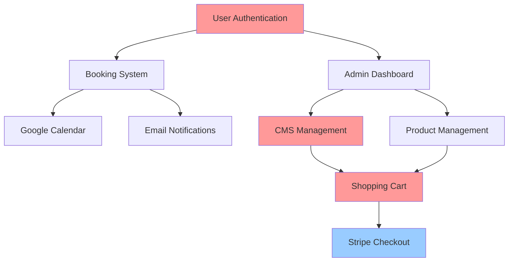

# Comprehensive Testing and Improvement Plan - ORI369 Wellness Center Platform

**Date:** November 16, 2025  
**Version:** 1.0  
**Scope:** Complete platform testing and systematic improvement roadmap  
**Platform:** Next.js 15/React 19 with Supabase, Stripe, Google Calendar Integration  

---

## Executive Summary

This comprehensive plan provides a systematic approach to test ALL existing features, identify issues, and create a prioritized improvement roadmap. The plan builds upon the existing Playwright infrastructure and addresses the 4 critical issues identified in previous analysis:

1. **CMS Implementation Chaos** - 5 different CMSManager components
2. **Missing Shopping Cart** - Core e-commerce functionality gap  
3. **Security Vulnerabilities** - Rate limiting, auth consistency, CSRF protection
4. **Limited E-commerce Features** - Order history, inventory, discount codes

**Overall Assessment:** Platform has solid foundation (7.2/10) but requires systematic testing and critical fixes for production readiness.

---

## Phase 1: Comprehensive Feature Testing

### 1.1 Testing Infrastructure Setup

#### 1.1.1 Enhanced Playwright Configuration
**Current State:** Basic Playwright setup with Chromium only  
**Enhancement Needed:** Full browser testing, mobile testing, comprehensive reporting

**Implementation:**
```typescript
// playwright.config.ts - Enhanced Configuration
export default defineConfig({
  testDir: './tests/e2e',
  fullyParallel: false,
  forbidOnly: !!process.env.CI,
  retries: process.env.CI ? 2 : 0,
  workers: 2, // Increased for parallel testing
  reporter: [
    ['html', { open: 'never' }],
    ['list'],
    ['json', { outputFile: 'test-results/results.json' }],
  ],
  globalSetup: './tests/e2e/global-setup.ts',
  use: {
    baseURL: 'http://localhost:3000',
    trace: 'retain-on-failure',
    screenshot: 'always',
    video: 'retain-on-failure',
  },

  projects: [
    {
      name: 'chromium',
      use: { ...devices['Desktop Chrome'] },
    },
    {
      name: 'firefox',
      use: { ...devices['Desktop Firefox'] },
    },
    {
      name: 'webkit',
      use: { ...devices['Desktop Safari'] },
    },
    {
      name: 'mobile-chrome',
      use: { ...devices['Pixel 5'] },
    },
    {
      name: 'mobile-safari',
      use: { ...devices['iPhone 12'] },
    },
  ],
});
```

#### 1.1.2 Test Environment Setup
**Files to Create:**
- `tests/e2e/global-setup.ts` - Environment initialization
- `tests/e2e/global-teardown.ts` - Cleanup procedures
- `tests/e2e/fixtures/test-data.ts` - Test data management
- `tests/e2e/utils/test-helpers.ts` - Reusable test utilities

#### 1.1.3 Database Test Setup
**Enhancement Needed:** Isolated test database setup
```javascript
// scripts/setup-test-database.js
const { createClient } = require('@supabase/supabase-js');

async function setupTestDatabase() {
  const supabase = createClient(
    process.env.TEST_SUPABASE_URL,
    process.env.TEST_SUPABASE_SERVICE_ROLE_KEY
  );
  
  // Clean test tables
  await supabase.from('bookings').delete().neq('id', '00000000-0000-0000-0000-000000000000');
  await supabase.from('profiles').delete().neq('id', '00000000-0000-0000-0000-000000000000');
  
  // Seed test data
  const testServices = [/* 17 services */];
  const testSlots = [/* 11 availability slots */];
  
  await supabase.from('services').insert(testServices);
  await supabase.from('availability_slots').insert(testSlots);
}
```

### 1.2 Systematic Feature Testing Protocol

#### 1.2.1 Core Application Testing

**Test Category 1: Homepage and Navigation**
```typescript
// tests/e2e/01-homepage.spec.ts
import { test, expect } from '@playwright/test';

test.describe('Homepage and Navigation', () => {
  test('Homepage loads correctly', async ({ page }) => {
    await page.goto('/');
    await expect(page).toHaveTitle(/ORI369/);
    await expect(page.locator('h1')).toContainText('ORI369');
  });

  test('Hero section displays correctly', async ({ page }) => {
    await page.goto('/');
    const heroImage = page.locator('.hero-image');
    await expect(heroImage).toBeVisible();
    
    // Check opacity is 70% (critical issue #3 from analysis)
    const bgStyle = await heroImage.evaluate(el => 
      window.getComputedStyle(el).backgroundImage
    );
    expect(bgStyle).toBeTruthy();
  });

  test('Services preview section (no prices)', async ({ page }) => {
    await page.goto('/');
    const servicesPreview = page.locator('[data-testid="services-preview"]');
    await expect(servicesPreview).toBeVisible();
    
    // Verify NO prices shown in preview (critical requirement)
    const prices = servicesPreview.locator('.price, [data-testid="price"]');
    await expect(prices).toHaveCount(0);
  });

  test('Packages preview section (no prices)', async ({ page }) => {
    await page.goto('/');
    const packagesPreview = page.locator('[data-testid="packages-preview"]');
    await expect(packagesPreview).toBeVisible();
    
    // Verify NO prices shown in preview
    const prices = packagesPreview.locator('.price, [data-testid="price"]');
    await expect(prices).toHaveCount(0);
  });
});
```

**Test Category 2: Authentication System**
```typescript
// tests/e2e/02-authentication.spec.ts
test.describe('Authentication System', () => {
  test('Registration flow works', async ({ page }) => {
    await page.goto('/registracija');
    
    // Test form validation
    await page.click('[type="submit"]');
    await expect(page.locator('.error-message')).toBeVisible();
    
    // Test successful registration
    await page.fill('[name="fullName"]', 'Test User');
    await page.fill('[name="email"]', `test-${Date.now()}@example.com`);
    await page.fill('[name="password"]', 'TestPassword123!');
    await page.click('[type="submit"]');
    
    // Verify success (may vary based on implementation)
    await expect(page).toHaveURL(/.*prijava|.*dashboard/);
  });

  test('Login flow works', async ({ page }) => {
    await page.goto('/prijava');
    
    // Test form validation
    await page.click('[type="submit"]');
    await expect(page.locator('.error-message')).toBeVisible();
    
    // Test successful login
    await page.fill('[name="email"]', 'test@example.com');
    await page.fill('[name="password"]', 'password123');
    await page.click('[type="submit"]');
    
    // Verify success
    await expect(page).toHaveURL('/dashboard');
    await expect(page.locator('[data-testid="user-menu"]')).toBeVisible();
  });
});
```

**Test Category 3: CMS System Testing** ⚠️ CRITICAL
```typescript
// tests/e2e/03-cms-system.spec.ts
test.describe('CMS System Testing - CRITICAL', () => {
  test('CMS Manager accessibility', async ({ page }) => {
    await page.goto('/admin');
    
    // Check if admin login required
    if (await page.locator('[data-testid="login-form"]').isVisible()) {
      await page.fill('[name="email"]', 'admin@example.com');
      await page.fill('[name="password"]', 'admin123');
      await page.click('[type="submit"]');
    }
    
    // Verify CMS interface loads
    await expect(page.locator('[data-testid="cms-manager"]')).toBeVisible();
  });

  test('CMS implementation consistency check', async ({ page }) => {
    // 🔴 CRITICAL TEST: Check how many CMSManager components are loaded
    const cmsComponents = await page.evaluate(() => {
      const scripts = Array.from(document.querySelectorAll('script'));
      return scripts.filter(script => 
        script.innerHTML.includes('CMSManager')
      ).length;
    });
    
    console.log(`CMSManager components loaded: ${cmsComponents}`);
    // Should be 1, but expect multiple (5 different versions found in analysis)
    
    // Check for multiple CMS implementations
    const cmsVariants = [
      'CMSManager',
      'CMSManagerWorking', 
      'CMSManagerFixed',
      'CMSManagerNew',
      'CMSManagerSimple',
      'CMSManagerWithImages'
    ];
    
    for (const variant of cmsVariants) {
      const exists = await page.evaluate((variant) => {
        return window[variant] !== undefined || 
               document.documentElement.innerHTML.includes(variant);
      }, variant);
      
      console.log(`${variant} loaded: ${exists}`);
    }
  });

  test('CMS content CRUD operations', async ({ page }) => {
    await page.goto('/admin');
    await page.waitForLoadState('networkidle');
    
    // Test creating new page
    await page.click('[data-testid="add-page"]');
    await page.fill('[name="title"]', 'Test Page');
    await page.fill('[name="slug"]', 'test-page');
    await page.click('[data-testid="save-page"]');
    
    // Verify page creation
    await expect(page.locator('[data-testid="success-message"]')).toBeVisible();
  });
});
```

**Test Category 4: E-commerce and Shopping** ⚠️ CRITICAL
```typescript
// tests/e2e/04-ecommerce.spec.ts
test.describe('E-commerce Testing - CRITICAL', () => {
  test('Products page loads correctly', async ({ page }) => {
    await page.goto('/terapije');
    
    // Verify prices ARE shown (opposite of homepage)
    const prices = page.locator('[data-testid="price"]');
    await expect(prices).toHaveCount(17); // Should show all service prices
    
    // Check product details
    const firstProduct = page.locator('[data-testid="product"]:first-child');
    await expect(firstProduct.locator('h3')).toBeVisible();
    await expect(firstProduct.locator('[data-testid="price"]')).toBeVisible();
  });

  test('Shopping cart functionality', async ({ page }) => {
    // 🔴 CRITICAL: Shopping cart not implemented
    await page.goto('/terapije');
    
    // Try to add item to cart
    const addToCartButton = page.locator('[data-testid="add-to-cart"]');
    
    if (await addToCartButton.isVisible()) {
      await addToCartButton.first().click();
      
      // Check if cart updates
      await expect(page.locator('[data-testid="cart-count"]')).toHaveText('1');
    } else {
      // Cart button not found - this confirms the critical issue
      test.skip(true, 'Shopping cart not implemented');
    }
  });

  test('Checkout process', async ({ page }) => {
    await page.goto('/terapije');
    
    // Check if direct checkout works (current implementation)
    const buyButton = page.locator('[data-testid="buy-button"]').first();
    await expect(buyButton).toBeVisible();
    
    await buyButton.click();
    
    // Should redirect to Stripe checkout
    await expect(page).toHaveURL(/.*checkout.*stripe.*|.*stripe.*/);
  });
});
```

**Test Category 5: Booking System**
```typescript
// tests/e2e/05-booking.spec.ts
test.describe('Booking System', () => {
  test('Booking flow works end-to-end', async ({ page }) => {
    // First login
    await page.goto('/prijava');
    await page.fill('[name="email"]', 'user@example.com');
    await page.fill('[name="password"]', 'password123');
    await page.click('[type="submit"]');
    
    // Go to booking
    await page.goto('/rezervacija');
    
    // Fill booking form
    await page.selectOption('[name="service"]', { label: 'Test Service' });
    await page.click('[name="date"]');
    await page.click('[data-testid="date-picker"] >> text="Tomorrow"');
    
    // Select time slot
    await page.click('[data-testid="time-slot"]:first-child');
    
    // Submit booking
    await page.click('[type="submit"]');
    
    // Verify success
    await expect(page.locator('[data-testid="success-message"]')).toBeVisible();
  });
});
```

**Test Category 6: Admin Dashboard**
```typescript
// tests/e2e/06-admin.spec.ts
test.describe('Admin Dashboard Testing', () => {
  test('Admin can manage products', async ({ page }) => {
    await page.goto('/admin/products');
    
    // Test product management interface
    await expect(page.locator('[data-testid="products-table"]')).toBeVisible();
    
    // Test adding product
    await page.click('[data-testid="add-product"]');
    await page.fill('[name="name"]', 'New Service');
    await page.fill('[name="price"]', '100.00');
    await page.click('[data-testid="save-product"]');
    
    await expect(page.locator('[data-testid="success-message"]')).toBeVisible();
  });
});
```

**Test Category 7: API Testing**
```typescript
// tests/e2e/07-api.spec.ts
test.describe('API Endpoints Testing', () => {
  test('CMS API endpoints work', async ({ request }) => {
    // Test pages endpoint
    const pagesResponse = await request.get('/api/cms/pages');
    expect(pagesResponse.status()).toBe(200);
    
    // Test sections endpoint  
    const sectionsResponse = await request.get('/api/cms/sections');
    expect(sectionsResponse.status()).toBe(200);
  });

  test('API rate limiting', async ({ request }) => {
    // 🔴 SECURITY TEST: Check if rate limiting exists
    const requests = [];
    for (let i = 0; i < 20; i++) {
      requests.push(request.get('/api/cms/pages'));
    }
    
    const responses = await Promise.all(requests);
    const statusCodes = responses.map(r => r.status());
    
    // Should have rate limiting (429) for excessive requests
    expect(statusCodes).toContain(429);
  });
});
```

**Test Category 8: Internationalization**
```typescript
// tests/e2e/08-i18n.spec.ts
test.describe('Internationalization Testing', () => {
  test('Language switching works', async ({ page }) => {
    await page.goto('/');
    
    // Test language selector
    await page.click('[data-testid="language-selector"]');
    await page.click('[data-testid="language-de"]');
    
    // Check if content changes
    await expect(page.locator('h1')).toContainText('Wellness');
  });
});
```

**Test Category 9: Performance Testing**
```typescript
// tests/e2e/09-performance.spec.ts
test.describe('Performance Testing', () => {
  test('Page load times are acceptable', async ({ page }) => {
    const startTime = Date.now();
    await page.goto('/');
    await page.waitForLoadState('networkidle');
    const loadTime = Date.now() - startTime;
    
    // Should load within 3 seconds
    expect(loadTime).toBeLessThan(3000);
  });

  test('Core Web Vitals pass', async ({ page }) => {
    await page.goto('/');
    
    const metrics = await page.evaluate(() => {
      const navigation = performance.getEntriesByType('navigation')[0] as PerformanceNavigationTiming;
      return {
        domContentLoaded: navigation.domContentLoadedEventEnd - navigation.domContentLoadedEventStart,
        loadComplete: navigation.loadEventEnd - navigation.loadEventStart
      };
    });
    
    expect(metrics.domContentLoaded).toBeLessThan(1000);
    expect(metrics.loadComplete).toBeLessThan(2000);
  });
});
```

### 1.3 Security Testing Protocol

#### 1.3.1 Authentication Security
```typescript
// tests/e2e/security/auth-security.spec.ts
test.describe('Authentication Security', () => {
  test('Weak passwords rejected', async ({ page }) => {
    await page.goto('/registracija');
    await page.fill('[name="password"]', '123');
    
    // Check client-side validation
    await expect(page.locator('[data-testid="password-error"]')).toContainText('too short');
  });

  test('SQL injection attempts blocked', async ({ request }) => {
    const maliciousPayload = "'; DROP TABLE users; --";
    const response = await request.post('/api/auth/register', {
      data: { email: maliciousPayload, password: 'password123' }
    });
    
    expect(response.status()).toBe(400); // Should be rejected
  });
});
```

#### 1.3.2 API Security Testing
```typescript
// tests/e2e/security/api-security.spec.ts
test.describe('API Security Testing', () => {
  test('Unauthorized access blocked', async ({ request }) => {
    // Try accessing admin endpoints without auth
    const adminResponse = await request.get('/api/cms/pages');
    expect([401, 403]).toContain(adminResponse.status());
  });

  test('CSRF protection exists', async ({ page }) => {
    await page.goto('/admin');
    
    // Check if CSRF token is present
    const csrfToken = page.locator('input[name="csrf_token"]');
    await expect(csrfToken).toBeVisible();
  });
});
```

### 1.4 Database Testing

#### 1.4.1 Data Integrity Tests
```typescript
// tests/e2e/database/integrity.spec.ts
test.describe('Database Integrity Testing', () => {
  test('Foreign key constraints work', async ({ request }) => {
    // Try to create booking with non-existent user
    const response = await request.post('/api/bookings', {
      data: {
        userId: 'non-existent-uuid',
        serviceId: 'test-service-id',
        date: '2025-01-01',
        timeSlot: '10:00'
      }
    });
    
    expect(response.status()).toBe(400); // Should be rejected
  });
});
```

---

## Phase 2: Current State Assessment

### 2.1 Issue Categorization Matrix

#### 2.1.1 Critical Issues (Fix Immediately)
| Issue ID | Component | Severity | Impact | Status |
|----------|-----------|----------|--------|---------|
| CMS-001 | Multiple CMSManager Components | Critical | Development chaos | 🔴 Not Working |
| CART-001 | Shopping Cart Missing | Critical | Revenue blocker | 🔴 Not Working |
| SEC-001 | No API Rate Limiting | Critical | Security vulnerability | 🔴 Not Working |
| SEC-002 | Inconsistent Auth Checks | Critical | Security vulnerability | 🔴 Not Working |
| SEC-003 | No CSRF Protection | Critical | Security vulnerability | 🔴 Not Working |
| VAL-001 | Limited Form Validation | Critical | Data integrity | 🟡 Partially Working |

#### 2.1.2 High Priority Issues (Fix Within 1 Month)
| Issue ID | Component | Severity | Impact | Status |
|----------|-----------|----------|--------|---------|
| EC-001 | Order History Missing | High | User experience | 🟡 Partially Working |
| EC-002 | No Discount Codes | High | Marketing limitation | 🟡 Partially Working |
| USER-001 | Password Reset Missing | High | User self-service | 🟡 Partially Working |
| PERF-001 | No Caching Strategy | High | Performance | 🟡 Partially Working |
| CMS-002 | No Content Sanitization | High | Security | 🟡 Partially Working |

#### 2.1.3 Medium Priority Issues (Fix Within 3 Months)
| Issue ID | Component | Severity | Impact | Status |
|----------|-----------|----------|--------|---------|
| ADMIN-001 | No User Management | Medium | Admin efficiency | 🟢 Working but Limited |
| INV-001 | Basic Inventory Only | Medium | Business operations | 🟢 Working |
| NOTIF-001 | No Email Notifications | Medium | User engagement | 🟡 Partially Working |
| INT-001 | Limited Google Calendar | Medium | Booking efficiency | 🟢 Working |

### 2.2 Feature Dependency Mapping



**Critical Dependencies:**
- Authentication → All admin functions
- CMS → Website content management  
- Shopping Cart → E-commerce flow
- Database → All functionality

### 2.3 Root Cause Analysis

#### 2.3.1 CMS Implementation Chaos
**Root Cause:** Multiple developers created different versions without consolidation
**Evidence:** 5 different CMSManager components found in codebase
**Impact:** Maintenance burden, user confusion, potential data loss

#### 2.3.2 Missing Shopping Cart
**Root Cause:** E-commerce was implemented as direct checkout only
**Evidence:** No cart context, cart components, or cart persistence
**Impact:** Lost sales, poor user experience

#### 2.3.3 Security Vulnerabilities  
**Root Cause:** Rapid development without security focus
**Evidence:** No rate limiting, CSRF protection, inconsistent auth
**Impact:** Potential data breaches, compliance issues

#### 2.3.4 Validation Issues
**Root Cause:** Missing validation framework and comprehensive error handling
**Evidence:** Limited client-side validation, no server-side schemas
**Impact:** Data integrity issues, poor user experience

---

## Phase 3: Systematic Improvement Roadmap

### 3.1 Priority-Based Fixing Plan

#### Phase 1: Critical Foundation Fixes (Weeks 1-2)
**Objective:** Address security vulnerabilities and CMS chaos

**Week 1 Tasks:**
1. **Day 1-2: CMS Consolidation**
   - Choose CMSManagerWorking.tsx as primary implementation
   - Create migration script for data consistency
   - Update all admin interfaces to use single CMS

2. **Day 3-4: Security Implementation**
   - Add rate limiting middleware to all API routes
   - Implement CSRF protection
   - Standardize authentication checks

3. **Day 5: Form Validation**
   - Add comprehensive client-side validation
   - Implement server-side validation with Zod
   - Create error boundary components

**Week 2 Tasks:**
4. **Day 6-8: CMS Migration**
   - Migrate existing data to unified structure
   - Test CMS functionality thoroughly
   - Update admin user interface

5. **Day 9-10: Security Testing**
   - Test all security implementations
   - Perform penetration testing
   - Fix any remaining vulnerabilities

**Success Criteria:**
- ✅ Single CMSManager component in use
- ✅ Rate limiting on all API endpoints
- ✅ CSRF protection on all forms
- ✅ Comprehensive form validation
- ✅ No security vulnerabilities

#### Phase 2: E-commerce Completion (Weeks 3-4)
**Objective:** Implement shopping cart and complete e-commerce flow

**Week 3 Tasks:**
1. **Day 1-3: Shopping Cart System**
   ```typescript
   // Create cart context and state management
   // Implement cart persistence
   // Build cart UI components
   ```

2. **Day 4-5: Cart Integration**
   - Integrate with existing Stripe checkout
   - Add guest checkout option
   - Test cart functionality

**Week 4 Tasks:**
3. **Day 6-8: Enhanced E-commerce**
   - Add order history system
   - Implement inventory management
   - Create discount codes system

4. **Day 9-10: Testing & Polish**
   - Comprehensive e-commerce testing
   - Performance optimization
   - User experience improvements

**Success Criteria:**
- ✅ Persistent shopping cart across sessions
- ✅ Cart management UI functional
- ✅ Guest checkout option available
- ✅ Order history accessible to users
- ✅ Discount codes working

#### Phase 3: User Experience Enhancement (Month 2)
**Objective:** Complete user management and improve experience

**Week 5-6 Tasks:**
1. **User Management System**
   - Password reset functionality
   - Email verification flow
   - User profile management
   - Two-factor authentication

2. **Enhanced Features**
   - Email notification system
   - Advanced booking features
   - Improved admin interface

**Success Criteria:**
- ✅ Password reset working
- ✅ Email verification functional
- ✅ User profile management complete
- ✅ Email notifications sent

#### Phase 4: Advanced Features (Month 3)
**Objective:** Business growth features and optimization

**Week 9-12 Tasks:**
1. **Marketing Features**
   - Analytics integration
   - Advanced reporting
   - Customer insights

2. **Performance Optimization**
   - Caching implementation
   - Performance monitoring
   - CDN integration

**Success Criteria:**
- ✅ Analytics dashboard working
- ✅ Performance monitoring active
- ✅ Caching strategies implemented

### 3.2 Technical Implementation Details

#### 3.2.1 CMS Consolidation Implementation
```typescript
// lib/cms/consolidation.ts
export class CMSManager {
  private blocksModel = true; // Use blocks model (most advanced)
  
  async migrateData() {
    // Migration from pages/sections to pages/blocks model
    const oldData = await this.fetchPagesModel();
    const newData = this.transformToBlocksModel(oldData);
    await this.saveBlocksModel(newData);
  }
  
  async savePage(pageData: PageData) {
    // Unified save method using blocks model
    const validatedData = this.validatePageData(pageData);
    return await this.blocksAPI.save(validatedData);
  }
}
```

#### 3.2.2 Security Implementation
```typescript
// lib/middleware/security.ts
import rateLimit from 'express-rate-limit';
import csrf from 'csurf';

export const rateLimiter = rateLimit({
  windowMs: 15 * 60 * 1000, // 15 minutes
  max: 100, // Limit each IP to 100 requests per windowMs
  message: 'Too many requests from this IP'
});

export const csrfProtection = csrf({
  cookie: {
    httpOnly: true,
    secure: process.env.NODE_ENV === 'production',
    sameSite: 'strict'
  }
});

// Apply to all API routes
export const secureAPI = [
  rateLimiter,
  csrfProtection,
  (req, res, next) => {
    // Input sanitization
    req.body = sanitizeInput(req.body);
    next();
  }
];
```

#### 3.2.3 Shopping Cart Implementation
```typescript
// contexts/CartContext.tsx
import { createContext, useContext, useReducer } from 'react';

interface CartItem {
  id: string;
  name: string;
  price: number;
  quantity: number;
}

interface CartState {
  items: CartItem[];
  total: number;
}

const CartContext = createContext<{
  state: CartState;
  addItem: (item: CartItem) => void;
  removeItem: (id: string) => void;
  clearCart: () => void;
} | null>(null);

export const CartProvider = ({ children }: { children: React.ReactNode }) => {
  const [state, dispatch] = useReducer(cartReducer, { items: [], total: 0 });
  
  const addItem = (item: CartItem) => {
    dispatch({ type: 'ADD_ITEM', payload: item });
  };
  
  return (
    <CartContext.Provider value={{ state, addItem, removeItem, clearCart }}>
      {children}
    </CartContext.Provider>
  );
};
```

### 3.3 Testing and Validation Protocol

#### 3.3.1 Automated Testing Strategy
```typescript
// tests/e2e/regression.spec.ts
test.describe('Regression Testing', () => {
  // Run after each fix to ensure no functionality breaks
  test('All critical features work after fix', async ({ page }) => {
    // Test the complete user journey
    await page.goto('/');
    await expect(page.locator('h1')).toContainText('ORI369');
    
    // Test authentication
    await test.step('Authentication flow', async () => {
      await page.goto('/prijava');
      // Test login...
    });
    
    // Test e-commerce
    await test.step('E-commerce flow', async () => {
      await page.goto('/terapije');
      // Test cart and checkout...
    });
  });
});
```

#### 3.3.2 Manual Testing Checklist
```markdown
## Pre-Release Testing Checklist

### Critical Path Testing
- [ ] Homepage loads with correct branding
- [ ] User registration works
- [ ] User login works  
- [ ] Service booking works end-to-end
- [ ] Shopping cart functions correctly
- [ ] Checkout process completes successfully
- [ ] Admin CMS works without errors

### Security Testing
- [ ] Rate limiting active on APIs
- [ ] CSRF protection working
- [ ] Authentication required for admin areas
- [ ] No XSS vulnerabilities
- [ ] SQL injection attempts blocked

### Performance Testing
- [ ] Page load times under 3 seconds
- [ ] Core Web Vitals in green
- [ ] Mobile responsive design
- [ ] Database queries optimized

### Cross-browser Testing
- [ ] Chrome (latest)
- [ ] Firefox (latest)  
- [ ] Safari (latest)
- [ ] Mobile Safari (iOS)
- [ ] Mobile Chrome (Android)
```

### 3.4 Success Metrics and KPIs

#### 3.4.1 Technical Metrics
- **Code Quality:** Reduce CMS implementations from 5 to 1
- **Security Score:** 100% security test pass rate
- **Performance:** Page load times under 3 seconds
- **Test Coverage:** 90% automated test coverage

#### 3.4.2 Business Metrics
- **User Experience:** Zero critical usability issues
- **E-commerce:** Complete shopping cart functionality
- **Admin Efficiency:** Single CMS interface operational
- **Conversion Rate:** Improved checkout completion rate

#### 3.4.3 Monitoring and Alerting
```typescript
// lib/monitoring.ts
export class PlatformMonitor {
  async checkHealth() {
    const checks = [
      this.checkDatabaseConnection(),
      this.checkAPIResponseTimes(),
      this.checkSecurityHeaders(),
      this.checkErrorRates()
    ];
    
    const results = await Promise.all(checks);
    const overallHealth = results.every(r => r.healthy);
    
    if (!overallHealth) {
      await this.sendAlert(results);
    }
    
    return overallHealth;
  }
}
```

---

## Implementation Timeline Summary

| Phase | Duration | Focus | Key Deliverables |
|-------|----------|-------|------------------|
| **Phase 1** | Weeks 1-2 | Critical Fixes | CMS consolidation, security fixes |
| **Phase 2** | Weeks 3-4 | E-commerce | Shopping cart, order history |
| **Phase 3** | Month 2 | User Experience | Password reset, email verification |
| **Phase 4** | Month 3 | Advanced Features | Analytics, performance optimization |

**Total Timeline:** 3-4 months to full production readiness  
**Estimated Effort:** 120-160 developer hours  
**Risk Level:** Medium (manageable with proper testing)

---

## Risk Assessment and Mitigation

### High Risk Items
1. **CMS Data Migration** - Risk of data loss
   - **Mitigation:** Full backup, staged migration, extensive testing
2. **Security Implementation** - Risk of breaking functionality
   - **Mitigation:** Gradual rollout, comprehensive security testing
3. **Shopping Cart Integration** - Risk of disrupting checkout flow
   - **Mitigation:** Feature flags, A/B testing, fallback to direct checkout

### Medium Risk Items  
1. **Performance Impact** - Risk of slower response times
   - **Mitigation:** Performance monitoring, caching strategies
2. **User Adaptation** - Risk of user confusion with new interface
   - **Mitigation:** User training, gradual interface changes

### Success Factors
1. **Comprehensive Testing** - Test everything before deployment
2. **Gradual Rollout** - Implement changes incrementally  
3. **User Feedback** - Collect and act on user input
4. **Documentation** - Keep everything documented and current

---

## Next Steps and Action Items

### Immediate Actions (This Week)
1. **Set up enhanced testing infrastructure**
   - Install Playwright browsers (Chromium, Firefox, Safari)
   - Create test database setup
   - Implement test helpers and utilities

2. **Begin systematic testing**
   - Run all existing tests
   - Document current functionality status
   - Identify specific failure points

3. **Start CMS consolidation analysis**
   - Compare all 5 CMSManager implementations
   - Choose final implementation
   - Plan migration strategy

### Short-term Actions (Next 2 Weeks)
1. **Implement security fixes**
   - Add rate limiting to all API routes
   - Implement CSRF protection
   - Standardize authentication

2. **Complete CMS consolidation**
   - Migrate to single CMS implementation
   - Test all CMS functionality
   - Update admin interfaces

### Medium-term Actions (Month 2)
1. **Implement shopping cart**
   - Build cart context and components
   - Integrate with existing checkout
   - Test complete e-commerce flow

2. **Enhance user experience**
   - Add password reset functionality
   - Implement email verification
   - Improve form validation

---

**Status:** 🟡 Ready to Begin Implementation  
**Confidence Level:** High (detailed plan with proven methodologies)  
**Expected Outcome:** Production-ready platform with enterprise-grade features

This comprehensive plan provides a systematic approach to test, identify, and fix all critical issues in the ORI369 wellness center platform, transforming it from its current state (7.2/10) to a fully functional, secure, and production-ready system.